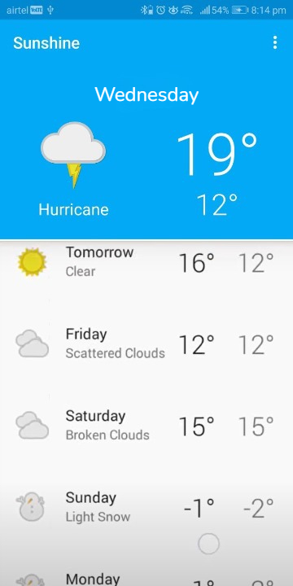
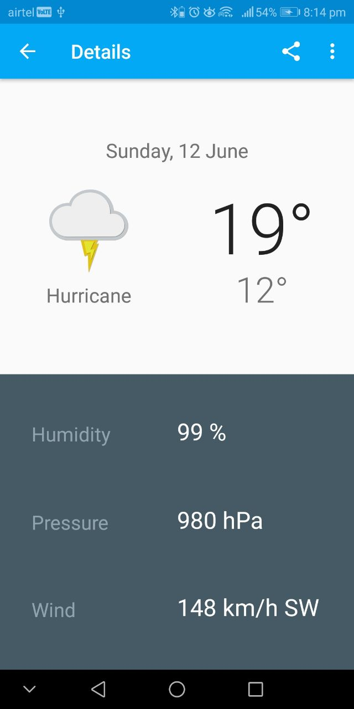
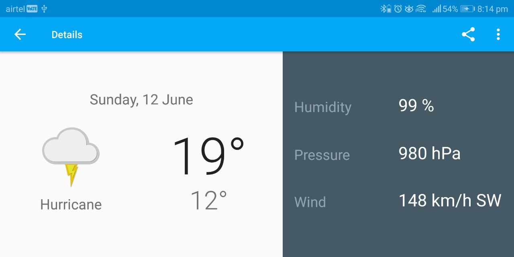
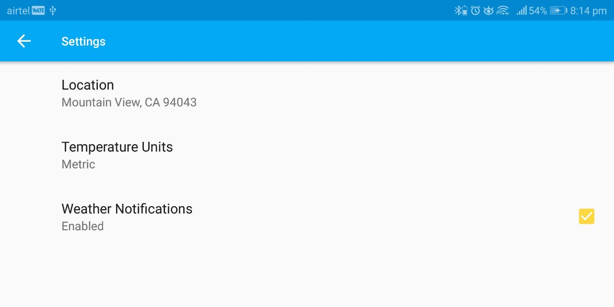

# Sunshine
Sunshine is a realtime location based weather app made using openweather api and a feel good UI.

# How to implement?

1. Clone the repo or download the source code on your local machine.

# Screenshots

## MainScreen

  

## Detail Screen 

    

## Settings screen

## Contributing

Contributions are always welcome!

If you have any suggestions or any feedback please create an issue.

Please adhere to this project's `code of conduct`.
 
## Installation 

If anyone needs the apk please, create an issue. 
    
## Support

For support, email pratyushsingh9473@gmail.com .
